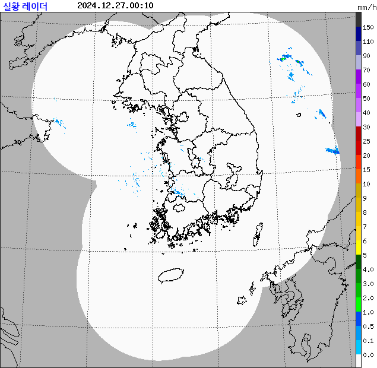

# krapo

## MID_FCST (기상청_중기예보 조회서비스) 
 - api token 발급 : https://www.data.go.kr/tcs/dss/selectApiDataDetailView.do?publicDataPk=15059468


```go
package main

import (
	"fmt"
	"log"
	"testing"

	"github.com/fluffy-melli/krapo/MID_FCST"
)

func main(t *testing.T) {
	info, err := MID_FCST.GetFcst("API-TOKEN")
	if err != nil {
		log.Fatalln(err)
	}
	fmt.Println(info[0])
}
```

```txt
○ (강수) 1월 2일(목) 오후~3일(금) 오전 제주도에 비 또는 눈이 오는 곳이 있겠습니다.
○ (기온) 이번 예보기간 아침 기온은 -10~2도, 낮 기온은 0~10도로 평년(최저기온 -9~0도, 최고기온 2~9도)과 비슷하겠습니다.
○ (해상) 1월 2일(목)~3일(금)은 동해상에 물결이 1.0~4.0m로 매우 높게 일겠습니다.

* 이번 예보기간 동안 강원산지와 동해안을 중심으로 대기가 건조하겠으니, 산불 등 각종 화재 예방에 유의하기 바랍니다.
* (변동성) 1월 2일(목)~3일(금)은 우리나라 주변 기압계의 흐름에 따라 예보가 변경될 가능성이 있겠으니, 앞으로 발표되는 최신 예보를 참고하기 바랍니다.
```

---

## RDR_CMP (기상청_레이더영상 조회서비스) 
 - api token 발급 : https://www.data.go.kr/tcs/dss/selectApiDataDetailView.do?publicDataPk=15056924

### 기본 사용법
```go
package main

import (
	"fmt"
	"log"
	"testing"

	"github.com/fluffy-melli/krapo"
	"github.com/fluffy-melli/krapo/RDR_CMP"
	"github.com/fluffy-melli/krapo/render"
)

func main(t *testing.T) {
	urls, err := RDR_CMP.GetImagesURL("API-TOKEN", krapo.Time())    // 오늘 레이더 위성사진 URL 들을 가져와요
	urls, err := RDR_CMP.GetImagesURL("API-TOKEN", krapo.LTime(1))  // 어제 레이더 위성사진 URL 들을 가져와요
	urls, err := RDR_CMP.GetAllURL("API-TOKEN")                     // 어제부터 지금까지 레이더 위성사진 URL 들을 가져와요
	if err != nil {
		log.Fatalln(err)
	}
	fmt.Println(urls)
}

```

```
http://www.kma.go.kr/repositary/image/rdr/img/RDR_CMP_WRC_202412310000.png
.......
http://www.kma.go.kr/repositary/image/rdr/img/RDR_CMP_WRC_202412302355.png
```
---
### GIF 렌더링

```go
package main

import (
	"log"

	"github.com/fluffy-melli/krapo"
	"github.com/fluffy-melli/krapo/RDR_CMP"
	"github.com/fluffy-melli/krapo/render"
)

func main() {
	urls, err := RDR_CMP.GetImagesURL("API-TOKEN", krapo.Time())
	if err != nil {
		log.Fatalln(err)
	}
	gif, err := render.GIF(urls, 2, false) // GIF 속도를 2/100 초 (20ms) 로 설정하고 모든 이미지를 렌더링해요
	gif, err := render.GIF(urls, 10, true) // GIF 속도를 10/100 초 (100ms) 로 설정해요 일부 이미지만 렌더링해요
	if err != nil {
		log.Fatalln(err)
	}
	err = render.Write("./test.gif", gif)
	if err != nil {
		log.Fatalln(err)
	}
}
```
 - GIF 렌더링 옵션이 (2 , false) 인 경우  |  GIF 속도를 2/100 초 (20ms) 로 설정하고 모든 이미지를 렌더링해요
<p align="left">
    
</p>

 - GIF 렌더링 옵션이 (10 , true) 인 경우  |  GIF 속도를 10/100 초 (100ms) 로 설정해요 일부 이미지만 렌더링해요
<p align="left">
    
</p>