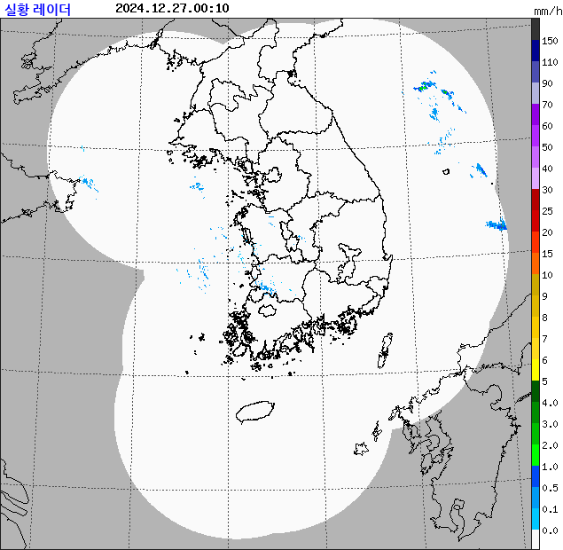

# krapo

## RDR_CMP (기상청_레이더영상 조회서비스) 
 - api token 발급 : https://www.data.go.kr/tcs/dss/selectApiDataDetailView.do?publicDataPk=15056924


```go
package main

import (
	"log"

	"github.com/fluffy-melli/krapo"
	"github.com/fluffy-melli/krapo/RDR_CMP"
	"github.com/fluffy-melli/krapo/render"
)

func main() {
	urls, err := RDR_CMP.GetImagesURL("API-TOKEN", krapo.Time())
	if err != nil {
		log.Fatalln(err)
	}
	gif, err := render.GIF(urls, 10, true)
	if err != nil {
		log.Fatalln(err)
	}
	err = render.Write("./test.gif", gif)
	if err != nil {
		log.Fatalln(err)
	}
}

```


<p align="center">
    
</p>